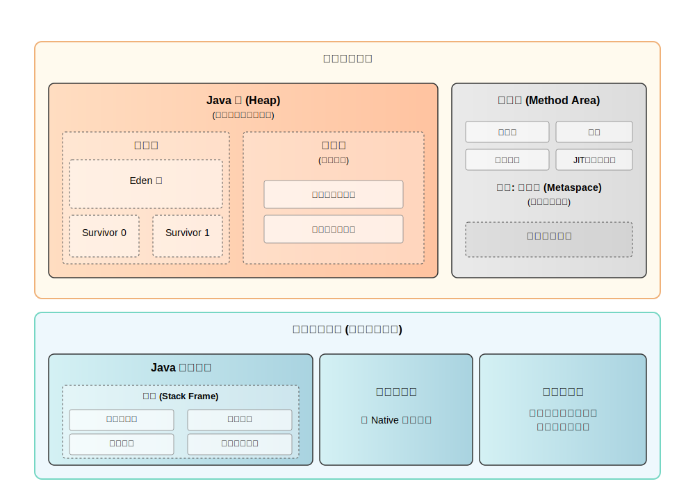
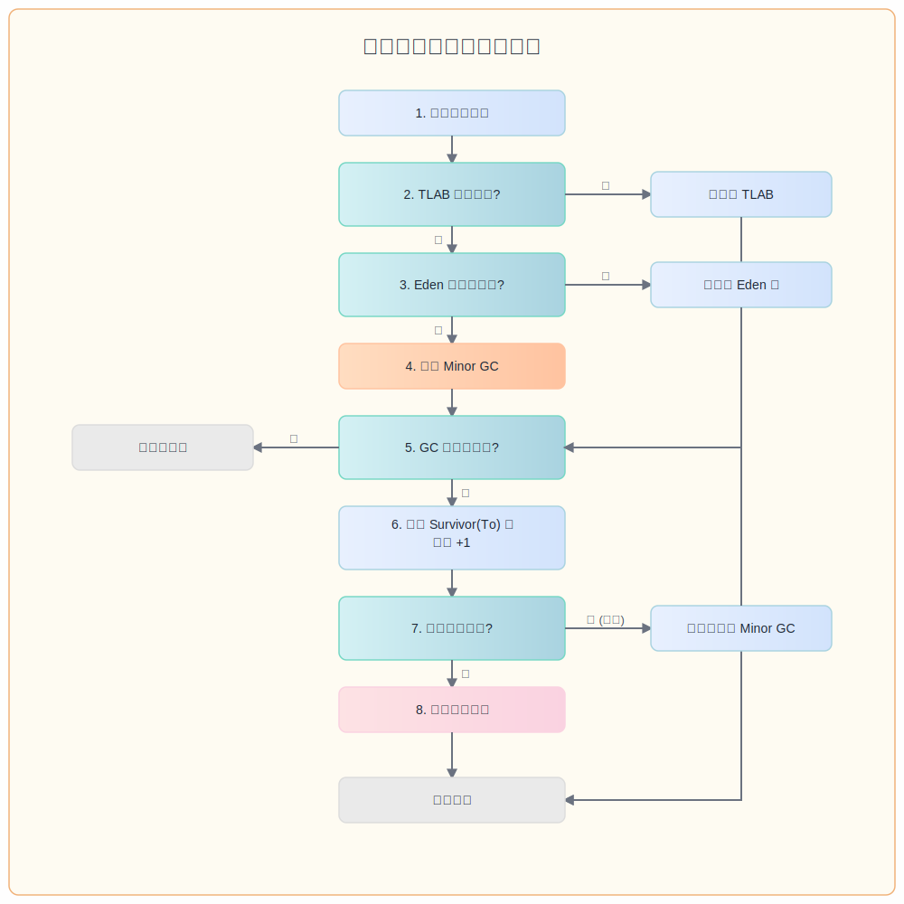

# JVM 内存结构深度解析
> JVM 内存结构是理解 Java 程序执行的核心，本文将深入剖析各个内存区域的作用、特点和管理机制。

## 核心架构概览



## 【核心讲解】

#### 本质定义

JVM 内存结构，是 Java 虚拟机为实现“一次编写，到处运行”的承诺，而对物理内存进行的**标准化、逻辑化的区域划分与管理模型**。它并非物理内存的直接映射，而是基于程序数据的**生命周期、线程所有权、访问模式**三大维度，构建的一套优雅而高效的内存管理契约。

#### 核心价值

其核心价值在于，通过规范化的内存分区，一举解决了两大根本性难题：
1.  **自动化内存管理的可行性**：通过将对象按生命周期分代分区（如新生代、老年代），为垃圾回收器的高效运作提供了“剧本”，实现了内存的自动回收。
2.  **多线程并发执行的安全性与高效性**：通过划分**线程私有**（如虚拟机栈）与**线程共享**（如堆）区域，既保证了线程内部操作的高速无锁，又为线程间的安全通信提供了统一的数据舞台。

#### 设计初衷

诞生于上世纪90年代的 Java，其设计哲学是屏蔽底层硬件和操作系统的差异。JVM 内存结构正是这一哲学的集中体现，它为所有 Java 程序提供了一个**稳定、可预测、跨平台**的内存运行时环境，是 Java 平台无关性的重要基石。

#### 关键特征

1.  **分而治之 (Divide and Conquer)**: 将复杂的内存管理问题，分解为对**堆、栈、方法区**等不同区域的独立管理，每个区域都有明确的职责和生命周期。
2.  **动静分离**: **栈**管理方法的动态调用过程（运行），**堆**管理对象的静态存储（数据），实现了“程序执行”与“数据存储”的逻辑解耦。
3.  **所有权明晰**: 内存区域被清晰地界定为**线程私有**（虚拟机栈、本地方法栈、程序计数器）和**线程共享**（Java堆、方法区），从根本上定义了并发编程的数据边界。

---

## 【详细讲解】

### 线程共享区域：协作与竞争的舞台

此区域的数据由所有线程共享，是并发编程中数据交换的核心地带，也是垃圾回收器重点关注的区域。

#### 1. Java 堆 (Heap) - 对象实例的生命舞台

Java 堆是 JVM 所管理内存中最大、最核心的一块区域，承载着几乎所有对象实例和数组的生命周期。它的设计优劣，直接决定了 Java 程序的性能和稳定性。

##### 技术架构深度解析

**分层架构设计（以 HotSpot G1 以前的收集器为例）**:
-   **新生代 (Young Generation)**: 占据约 1/3 堆空间，是绝大多数对象短暂一生的起点。
    -   **Eden 区**: 占据新生代 80% 空间，是新对象的“伊甸园”。
    -   **Survivor 区 (From/To)**: 各占新生代 10% 空间，是对象经历 GC 洗礼后的“幸存者”避难所。
-   **老年代 (Old Generation)**: 占据约 2/3 堆空间，是存放经过多次 GC 考验后“长寿”对象的归宿。
-   **关联区域 - 元空间 (Metaspace)**: JDK 8 后，用于存储类元数据的区域从堆内（永久代）移至**本地内存 (Native Memory)**，彻底解决了永久代空间不足的问题。

**核心组件协作机制**:
-   **TLAB (Thread-Local Allocation Buffer)**: 线程私有分配缓冲区。为避免多线程并发分配对象时的锁竞争，JVM 会为每个线程在 Eden 区预分配一小块私有内存（约占 Eden 1%），新对象优先在此分配，实现了**高速、无锁**的对象创建。
-   **垃圾收集器 (Garbage Collector)**: 负责自动回收“死亡”对象，释放内存空间。不同的收集器（如 Serial, Parallel, CMS, G1, ZGC）采用不同策略，以平衡吞吐量和停顿时间。

**数据流向精确化：一个对象的典型旅程**

<div style="text-align: center; margin: 20px 0; padding: 20px; background: #fafbfc; border: 1px solid #e1e5e9; border-radius: 8px;">
  <h3 style="margin-bottom: 15px; color: #333;">Java 对象分配与晋升流程图</h3>
  
</div>

1.  **诞生于 Eden**: 绝大多数新对象在 **Eden 区**通过 TLAB 快速分配。
2.  **首次幸存**: 当 Eden 区满，触发 **Minor GC**。存活的对象被复制到 **Survivor To 区**，年龄计数器置为 1。
3.  **“幸存者”的迁徙**: 每次 Minor GC，存活对象都会在两个 Survivor 区之间来回复制，年龄加 1。
4.  **晋升老年代**: 当对象年龄达到晋升阈值（默认为 15，-XX:MaxTenuringThreshold），或 Survivor 区无法容纳时，它将被“晋升”到**老年代**。
5.  **大对象直通车**: 超过特定大小（-XX:PretenureSizeThreshold）的对象，会直接在**老年代**分配，以避免新生代频繁的复制操作。

##### 关键算法与数据结构

**算法选择的深层逻辑**:
-   **理论基础 - 弱分代假说 (Weak Generational Hypothesis)**:
    -   绝大多数对象都是“朝生夕灭”的。
    -   熬过越多次垃圾回收的对象越难以消亡。
-   **新生代 - 复制算法 (Copying Algorithm)**:
    -   **时间复杂度**: O(存活对象数量)。由于新生代存活对象极少（通常 < 10%），效率极高。
    -   **优点**: 实现简单，无内存碎片。
    -   **缺点**: 需要额外 50% 的空间作为担保（一个 Survivor 区）。
-   **老年代 - 标记-清除 (Mark-Sweep) / 标记-整理 (Mark-Compact) 算法**:
    -   **时间复杂度**: O(N + M)，其中 N 为存活对象数，M 为堆大小，开销较大。
    -   **标记-清除**: 效率较高，但会产生内存碎片。
    -   **标记-整理**: 解决了碎片问题，但需要移动对象，成本更高。CMS 主要使用前者，而 Serial Old, Parallel Old, G1 则包含整理阶段。

**关键数据结构**:
-   **Card Table (卡表)**: 为解决跨代引用问题而生。它将老年代内存划分为一系列固定大小（如 512 字节）的“卡页”。当老年代对象引用新生代对象时，其对应的卡页被标记为“脏”(dirty)。Minor GC 时，只需扫描这些“脏”卡页即可找到所有跨代引用，避免了全堆扫描的巨大开销。

##### 【生产实践深度】

**关键配置 (Key Configurations)**:
-   `-Xms<size>` / `-Xmx<size>`: 堆的初始和最大大小。生产环境**强烈推荐**将两者设为相等，以避免堆动态扩容带来的性能抖动。
-   `-Xmn<size>`: 新生代的大小，通常建议为整个堆的 1/3 到 1/4。
-   `-XX:SurvivorRatio=<ratio>`: Eden 区与单个 Survivor 区的大小比例，默认为 8，即 Eden:S0:S1 = 8:1:1。
-   `-XX:MaxTenuringThreshold=<threshold>`: 对象晋升老年代的年龄阈值，默认 15。可根据应用的对象生命周期特征进行调整。

**监控指标 (Monitoring Metrics)**:
-   **对象分配速率 (Allocation Rate)**: 每秒分配的对象大小，是衡量应用压力的核心指标。
-   **晋升速率 (Promotion Rate)**: 从新生代晋升到老年代的速率。过高的晋升率可能预示着新生代空间不足或晋升阈值不合理。
-   **GC 频率与耗时**: 监控 Minor GC 和 Full GC 的频率及 STW (Stop-The-World) 时间。健康的系统应保持低频、短耗时的 Full GC。

**常见陷阱与解决方案 (Common Pitfalls & Solutions)**:
-   **问题**: `OutOfMemoryError: Java heap space`
-   **根因分析**:
    1.  **内存泄漏 (Memory Leak)**: 对象被无意持有，无法被 GC 回收。
    2.  **内存溢出 (Memory Bloat)**: 应用本身需要巨大内存，超出了堆大小限制。
-   **诊断工具**: `-XX:+HeapDumpOnOutOfMemoryError` 生成堆转储快照，使用 **MAT (Memory Analyzer Tool)** 或 **JProfiler** 进行离线分析，定位内存消耗的源头。

#### 2. 方法区 (Method Area) - 类的元数据殿堂

方法区存储已被虚拟机加载的**类信息、常量、静态变量、即时编译器编译后的代码缓存**等数据。

##### 【演进与对比】分析：从永久代到元空间

**关联性质说明**: **替代演进关系**。元空间是 JDK 8 对永久代的彻底重构，旨在解决永久代固有的设计缺陷。

| 维度 | 永久代 (PermGen, JDK 7-) | 元空间 (Metaspace, JDK 8+) | **演进动因与优势** |
| :--- | :--- | :--- | :--- |
| **存储位置** | JVM **堆**内存 | **本地内存** (Native Memory) | **解耦**：彻底摆脱 `-Xmx` 堆大小限制，避免因类加载过多引发 OOM。|
| **大小限制** | `-XX:MaxPermSize` 固定上限 | 仅受限于物理内存 | **弹性伸缩**：动态调整大小，极大提升了灵活性和稳定性。|
| **GC 策略** | 与 Full GC **强耦合** | 独立的 Metaspace GC | **性能提升**：元空间回收不再必然触发 Full GC，显著降低了 STW 停顿风险。|

##### 【生产实践深度】

**关键配置**:
-   `-XX:MetaspaceSize=<size>`: 元空间初始大小。设置一个合理的初始值可以避免频繁扩容。
-   `-XX:MaxMetaspaceSize=<size>`: 元空间最大大小。强烈建议设置上限，防止无限制使用本地内存导致系统崩溃。
-   `-XX:CompressedClassSpaceSize=<size>`: 压缩类指针空间大小，默认 1GB。

**故障处理**:
-   **问题**: `OutOfMemoryError: Metaspace`
-   **根因分析**: 动态类生成（如 CGLIB）、类加载器泄漏。
-   **诊断工具**: `jcmd <pid> VM.classloader_stats` 查看类加载器统计，`jmap -clstats <pid>` 查看类加载信息。

### 线程私有区域：高效执行的基石

此区域与线程一一对应，随线程的创建而生，随线程的结束而亡，为 Java 方法的高效执行提供了独立的、无竞争的工作空间。

#### 1. Java 虚拟机栈 (JVM Stack) - 方法执行的轨迹

##### 技术架构深度解析

-   **核心单元 - 栈帧 (Stack Frame)**: 每个方法调用都对应一个栈帧。它是一个包含了**局部变量表、操作数栈、动态链接、方法返回地址**等信息的复杂数据结构。
-   **工作模式**: 方法调用时，新栈帧**入栈**，成为当前栈帧；方法执行完毕，对应栈帧**出栈**。整个过程遵循“后进先出”(LIFO)原则，完美契合了程序调用的嵌套结构。

##### 【生产实践深度】

-   **关键参数**: `-Xss<size>` 设置每个线程的栈大小。默认值（如 1MB）通常足够，但无限递归或方法栈帧过大会导致 `StackOverflowError`。
-   **性能优化 - 逃逸分析 (Escape Analysis)**: JIT 编译器的一项强大优化。如果一个对象在方法内创建后，其引用从未“逃逸”出该方法（即未被外部引用），编译器**可能**会将其优化为**栈上分配 (Stack Allocation)**。
    -   **优点**: 对象在方法结束时随栈帧一同销毁，无需 GC介入，极大减轻了堆内存分配压力和 GC 负担。这是 HotSpot VM 中一项重要的性能优化。

#### 2. 程序计数器 (PC Register) - 执行的下一站指针

它是一块极小的内存空间，记录着当前线程正在执行的字节码指令的地址。它是线程执行状态的“书签”，使得线程在被挂起和恢复后，能准确地回到上次执行的位置。它是 JVM 内存区域中**唯一没有规定任何 OutOfMemoryError 情况**的区域。

#### 3. 本地方法栈 (Native Method Stack) - JNI 的舞台

为调用**本地方法 (Native Method)** 服务。当一个 Java 方法通过 JNI (Java Native Interface) 调用 C/C++ 等本地代码时，本地方法栈负责管理其调用过程。在 HotSpot 虚拟机中，它与 Java 虚拟机栈被合二为一。

---

## 【系统性案例分析：一个对象的完整生命周期】

### 场景背景
我们将通过一个简单的 Spring Boot Controller 端点，追踪一个 `UserDTO` 对象从HTTP请求创建，到最终被垃圾回收的完整生命周期，以此串联所有内存区域的协作。

```java
// DTO 对象
public class UserDTO {
    private Long id;
    private String name;
    // ... a large number of other fields to make it a non-trivial object
}

// Controller
@RestController
public class UserController {
    @GetMapping("/user/{id}")
    public UserDTO getUser(@PathVariable Long id) {
        // 1. 对象创建
        UserDTO user = new UserDTO(id, "Galahad"); 
        
        // 2. 业务处理 (假设有一些...)
        log.info("Processing user: {}", user);
        
        // 3. 方法返回
        return user;
    }
}
```

### 实施细节：追踪对象的内存足迹

1.  **阶段一：类的加载与元数据准备 (方法区)**
    -   Spring Boot 应用启动时，`UserController` 和 `UserDTO` 的 `.class` 文件被**类加载器**加载。
    -   它们的类元信息、方法字节码、常量池等被存放在**方法区**（元空间）。

2.  **阶段二：方法调用与栈帧创建 (虚拟机栈)**
    -   一个 HTTP 请求 `GET /user/1` 到达。
    -   Tomcat 线程池中的一个工作线程开始处理该请求。
    -   JVM 为该线程的 `getUser` 方法调用创建一个**栈帧**，并压入该线程的**虚拟机栈**。栈帧中包含了 `id` 参数和局部变量 `user` 的空间。

3.  **阶段三：对象实例化与堆内存分配 (Java 堆)**
    -   执行 `new UserDTO(...)`。
    -   JVM 在**Java 堆**的 **Eden 区**，通过 **TLAB** 为 `UserDTO` 对象实例分配内存。
    -   `getUser` 栈帧中的 `user` 局部变量，存储的是指向这个堆上对象的**引用地址**。

4.  **阶段四：指令执行与程序计数 (CPU与寄存器)**
    -   `log.info` 等业务逻辑执行。
    -   **程序计数器**忠实地记录着字节码的执行位置。
    -   **操作数栈**在方法内部进行着数据交换。

5.  **阶段五：对象逃逸与分代流转 (堆)**
    -   `getUser` 方法执行完毕，将 `user` 对象的引用返回给 Spring MVC 框架。此时，`UserDTO` 对象发生了**“逃逸”**，它的生命周期超过了创建它的方法。
    -   `getUser` 方法对应的**栈帧出栈**，但堆上的 `UserDTO` 对象因为被外部（MVC框架）引用而**存活**下来。
    -   不久后，Eden 区满，触发 **Minor GC**。`UserDTO` 对象因为存活，被复制到 **Survivor 区**，年龄 +1。
    -   如果该对象持续被引用（例如，被缓存），它将在多次 Minor GC 后，最终**晋升到老年代**。

6.  **阶段六：对象消亡与内存回收 (GC)**
    -   HTTP 响应完成，Spring MVC 框架不再持有对 `UserDTO` 对象的引用。
    -   在未来的某次 GC（Minor GC 或 Full GC）中，垃圾收集器通过**可达性分析**，从 GC Roots（如虚拟机栈中的引用）出发，发现该 `UserDTO` 对象不再可达。
    -   该对象被标记为“垃圾”，其占用的内存最终被**回收**，生命周期结束。

---

## 【总结与升华】

### 核心思想回顾

-   **空间换时间**：TLAB 和复制算法是典型的空间换时间策略，通过预留和冗余空间，实现了高效的并发分配和回收。
-   **分代定策**：根据不同内存区域中对象的存活特性，采用最优的垃圾回收策略，是 JVM 高效能的关键。
-   **抽象与隔离**: JVM 内存结构是对底层硬件的完美抽象，其清晰的区域隔离是 Java 并发模型和安全模型的基础。

### 未来展望：新一代 ZGC 与 Shenandoah

新一代的垃圾收集器如 ZGC 和 Shenandoah，通过更复杂的着色指针 (Colored Pointers) 和转发指针 (Forwarding Pointers) 技术，将 STW 时间压缩至亚毫秒级别，几乎实现了“无停顿”的并发回收。它们的设计，进一步模糊了分代的界限，代表着 JVM 内存管理正朝着**更低延迟、更高吞吐**的极限不断演进。

深入理解 JVM 内存结构，不仅是面试的必考题，更是每一位渴望写出健壮、高效、可扩展的 Java 程序的工程师，必须内化的核心知识。它是一门关于**空间、时间、生命周期**的架构艺术。 