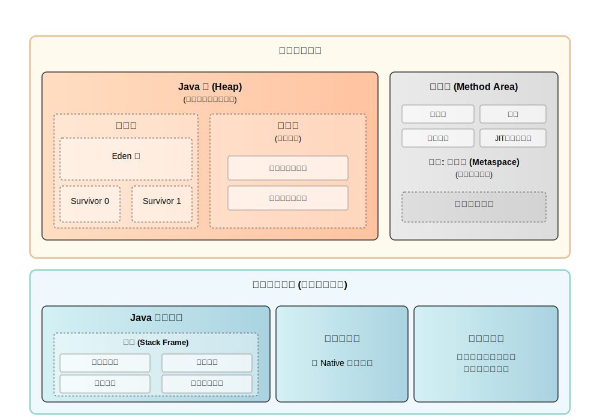

# SVG 显示测试

## 本地路径测试

### 使用绝对路径（GitHub格式）

### 使用相对路径

### 使用GitHub Raw URL

## 问题分析

如果上述任何一种方式都无法显示图片，可能的原因：

1. **GitHub缓存问题**：有时GitHub需要一些时间来更新文件缓存
2. **SVG浏览器兼容性**：某些SVG特性在GitHub的显示引擎中可能不被支持
3. **文件大小限制**：GitHub对SVG文件的大小或复杂度可能有限制
4. **网络问题**：图片加载可能因为网络问题而失败

## 解决方案

1. **等待缓存更新**：GitHub有时需要几分钟到几小时来更新缓存
2. **简化SVG**：如果SVG过于复杂，可以尝试简化
3. **使用PNG/JPEG替代**：对于复杂的图表，可以考虑导出为位图格式
4. **检查文件完整性**：确保SVG文件没有损坏或包含非法字符

## 当前文件信息

- 文件路径：`docs/public/assets/java/jvm/jvm-memory-structure-diagram.svg`
- 文件大小：约5.76KB
- 行数：91行
- 最后修改：Jul 12, 2025 